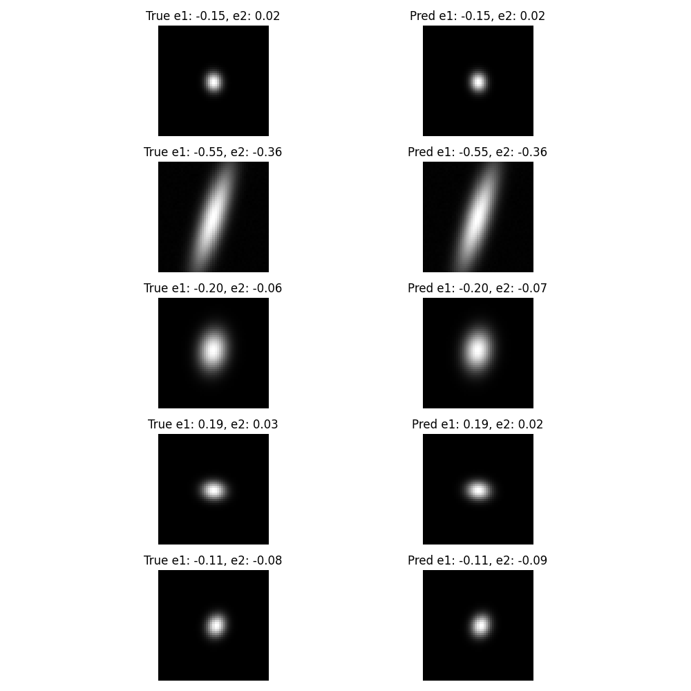
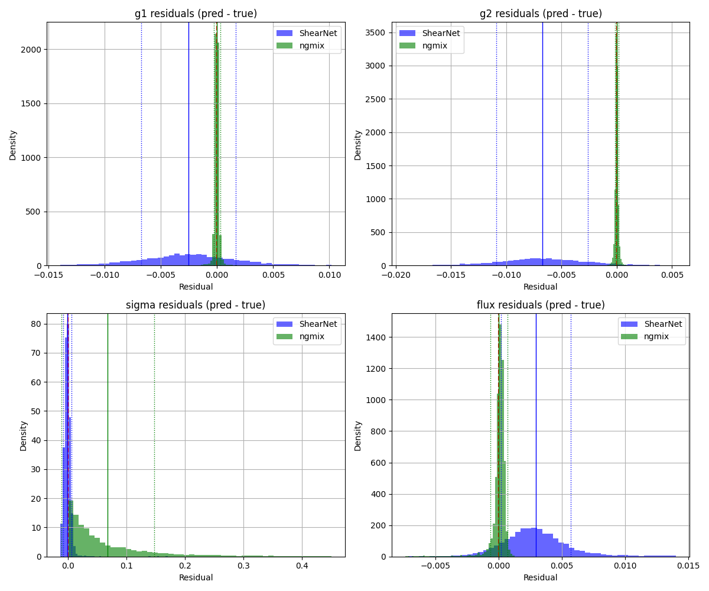

# Table of Content
- [Motivation](#motivation)
- [The Plan](#the-plan)
  - [Week 1: Foundations and Core Concepts](#week-1-foundations-and-core-concepts)
  - [Week 2: Advanced Architectures and Astrophysics Applications](#week-2-advanced-architectures-and-astrophysics-applications)
  - [Daily Schedule Structure](#daily-schedule-structure)
  - [Resources and Tools](#resources-and-tools)
  - [Assessment and Progress Tracking](#assessment-and-progress-tracking)

# Motivation  
This repository is going to be used for a 2 week bootcamp to learn CNNs.  
My advisor has told me that CNNs, especially by the time I apply for graduate programs in astrophysics in about 2 years, will be dominating astrophysics.  
I also am actively working on the repository at [ShearNet](https://github.com/s-Sayan/ShearNet) this summer where I am directly working with CNN architecture. Going into this work my objective is to make ShearNet better at measuring g1 and g2 of low-noise data. For some reason ShearNet is being massively outperformed by NGMix at noise levels around 1.0e-5. Here is a sample plot and the plot of the residuals for those who understand.  

  
  
Figure 1. Samples Plot at Low-Noise

  
  
Figure 2. ShearNet vs. NGMix Residuals

I really feel truly learning this content is key to my success in astrophysics, I really want to be in a graduate program in 2 years, so I want to put extra effort into actually learning this right now. Instead of making random guessing and tweaking random numbers to tune the CNN architecture, I really want to understand and make educated guess.  
I hope to house a lot of documentation here on my process of learning CNNs with the context of astrophysics.  

# The Plan 
So I have from today 6/18/2025 till the end of 7/1/2025 to learn CNNs from the ground up. Here is a comprehensive plan that I will use to set my goals and initial pacing:

## Week 1: Foundations and Core Concepts

### Days 1-2 (June 18-19): Mathematical Foundations and Neural Network Basics
**Learning Objectives:** Understand the mathematical principles that make CNNs work, with special attention to how these apply to image processing tasks like galaxy shape measurement.

**Day 1 Focus:** Linear algebra foundations and basic neural networks
- Review matrix operations, especially convolution as matrix multiplication
- Understand backpropagation from first principles (not just as a black box)
- Implement a simple perceptron from scratch to solidify understanding
- Connect these concepts to how astronomical images are represented as matrices

**Day 2 Focus:** Transition from fully connected to convolutional layers
- Understand why fully connected layers fail for images (parameter explosion, lack of translation invariance)
- Grasp the motivation behind weight sharing and local connectivity
- Implement basic convolution operations manually before using frameworks
- Explore how convolution preserves spatial relationships in astronomical data

**Practical Exercise:** Create a simple edge detection filter and apply it to sample galaxy images to see how convolution highlights features.

### Days 3-4 (June 20-21): Convolution Operations Deep Dive
**Learning Objectives:** Master the mechanics of convolution and understand how different kernel designs affect feature extraction.

**Day 3 Focus:** Convolution mechanics and variants
- Understand stride, padding, and dilation thoroughly
- Learn about different padding strategies and when to use each
- Explore how kernel size affects receptive field and computational cost
- Practice calculating output dimensions for different convolution configurations

**Day 4 Focus:** Pooling and feature map interpretation
- Understand max pooling vs average pooling and their trade-offs
- Learn about adaptive pooling and its applications
- Explore how pooling affects translation invariance vs spatial precision
- Analyze feature maps from different layers to understand hierarchical learning

**Practical Exercise:** Design and test different kernel configurations on astronomical images to see how they detect different features (edges, blobs, textures).

### Days 5-6 (June 22-23): Architecture Design Principles
**Learning Objectives:** Understand how to design CNN architectures that match the problem requirements, particularly for regression tasks like shear measurement.

**Day 5 Focus:** Classical architectures and their innovations
- Study LeNet, AlexNet, VGG progression and understand each innovation
- Learn about the depth vs width trade-offs
- Understand how architectural choices affect gradient flow
- Explore the relationship between architecture and task requirements

**Day 6 Focus:** Modern architectural innovations
- Understand residual connections and why they solve the vanishing gradient problem
- Learn about batch normalization and its stabilizing effects
- Explore different activation functions and their properties
- Study attention mechanisms and their applications to spatial data

**Practical Exercise:** Implement a simple CNN architecture for galaxy classification and systematically modify it to understand how each change affects performance.

### Day 7 (June 24): Week 1 Integration and ShearNet Analysis
**Learning Objectives:** Apply the week's learning to analyze the ShearNet architecture and identify potential improvement areas.

**Focus Areas:**
- Analyze the current ShearNet architecture through the lens of newly acquired knowledge
- Identify potential bottlenecks or design choices that might explain poor low-noise performance
- Formulate hypotheses about architectural modifications that could help
- Document findings and create a baseline understanding of the current system

**Practical Exercise:** Create a detailed architectural diagram of ShearNet with annotations about each component's purpose and potential issues.

## Week 2: Advanced Architectures and Astrophysics Applications

### Days 8-9 (June 25-26): Advanced CNN Techniques
**Learning Objectives:** Master advanced techniques that are particularly relevant to precision measurement tasks in astrophysics.

**Day 8 Focus:** Regularization and optimization
- Understand different forms of regularization (dropout, weight decay, data augmentation)
- Learn advanced optimization techniques (Adam, learning rate scheduling, warm-up)
- Explore techniques for handling overfitting in small datasets
- Study ensemble methods and their applications to uncertainty quantification

**Day 9 Focus:** Loss functions and training strategies
- Understand different loss functions for regression tasks
- Learn about multi-task learning and its applications to simultaneous g1/g2 prediction
- Explore curriculum learning and its potential for improving convergence
- Study techniques for handling class imbalance and rare events

**Practical Exercise:** Implement different loss functions for shear measurement and compare their behavior on synthetic data.

### Days 10-11 (June 27-28): Precision and Uncertainty in CNN Predictions
**Learning Objectives:** Understand how to achieve and measure precision in CNN predictions, crucial for scientific applications.

**Day 10 Focus:** Uncertainty quantification
- Learn about aleatoric vs epistemic uncertainty
- Understand Monte Carlo dropout and its applications
- Explore ensemble methods for uncertainty estimation
- Study how to calibrate CNN predictions for scientific accuracy

**Day 11 Focus:** Precision optimization techniques
- Learn about techniques for improving numerical precision
- Understand how different numerical precisions affect training and inference
- Explore techniques for reducing systematic biases in predictions
- Study methods for achieving sub-pixel precision in spatial measurements

**Practical Exercise:** Implement uncertainty quantification for shear measurements and compare with NGMix uncertainty estimates.

### Days 12-13 (June 29-30): Astrophysics-Specific Applications
**Learning Objectives:** Understand how CNNs are applied in astrophysics and what makes certain approaches successful.

**Day 12 Focus:** Literature review and case studies
- Study successful CNN applications in astrophysics (weak lensing, galaxy classification, transient detection)
- Analyze what architectural choices work well for different astrophysical problems
- Understand the specific challenges of astronomical data (noise characteristics, PSF effects, systematic errors)
- Learn about domain-specific data augmentation techniques

**Day 13 Focus:** Advanced architectures for spatial precision
- Study U-Net and its applications to spatial regression tasks
- Learn about attention mechanisms for focusing on relevant image regions
- Explore multi-scale architectures for handling objects of different sizes
- Understand how to incorporate physical priors into CNN architectures

**Practical Exercise:** Design a modified architecture for ShearNet that incorporates lessons learned from successful astrophysics applications.

### Day 14 (July 1): Integration and ShearNet Improvement Plan
**Learning Objectives:** Synthesize all learning into a concrete plan for improving ShearNet's performance.

**Focus Areas:**
- Create a comprehensive analysis of ShearNet's current limitations
- Design specific architectural modifications based on theoretical understanding
- Develop a testing protocol for evaluating improvements
- Create a research plan for continued development beyond the bootcamp

**Final Exercise:** Present a detailed improvement proposal for ShearNet with theoretical justification for each suggested change.

## Daily Schedule Structure

Each day follows a structured approach to maximize learning retention:

**Morning Session (2-3 hours):** Theoretical learning
- Read primary sources and textbooks
- Work through mathematical derivations
- Watch high-quality video lectures with active note-taking

**Afternoon Session (2-3 hours):** Practical implementation
- Code implementations from scratch when possible
- Experiment with different parameters and configurations
- Document observations and insights

**Evening Session (1 hour):** Reflection and documentation
- Summarize key insights in my own words
- Connect new knowledge to previous concepts
- Identify questions for further exploration
- Update my understanding of the ShearNet problem

## Resources and Tools

**Primary Textbooks:**
- "Deep Learning" by Goodfellow, Bengio, and Courville (theoretical foundation)
- "Hands-On Machine Learning" by Aurélien Géron (practical implementation)

**Astrophysics-Specific Resources:**
- Recent papers on weak lensing and CNN applications
- ShearNet original paper and related work
- NGMix documentation and papers for comparison

**Implementation Tools:**
- PyTorch for flexible architecture experimentation
- Jupyter notebooks for documentation and visualization
- Git for version control of experiments
- Weights & Biases for experiment tracking

**Datasets:**
- MNIST and CIFAR-10 for basic concept validation
- Simulated galaxy datasets for astrophysics applications
- The existing ShearNet data for direct comparison

## Assessment and Progress Tracking

**Daily Goals:** Each day includes specific, measurable learning objectives that build toward the overall goal of understanding CNN architectures deeply enough to improve ShearNet.

**Weekly Checkpoints:** 
- End of Week 1: Can I explain why current ShearNet architecture might struggle with low-noise data?
- End of Week 2: Can I propose specific, theoretically-justified improvements to ShearNet?

**Success Metrics:**
- Ability to implement CNN components from scratch
- Understanding of trade-offs in architectural decisions
- Capability to analyze and critique existing architectures
- Formulation of testable hypotheses for ShearNet improvements

**Documentation Requirements:**
- Daily learning logs with key insights
- Code implementations with detailed comments explaining the reasoning
- Weekly summary reports connecting theory to the ShearNet problem
- Final comprehensive analysis and improvement proposal