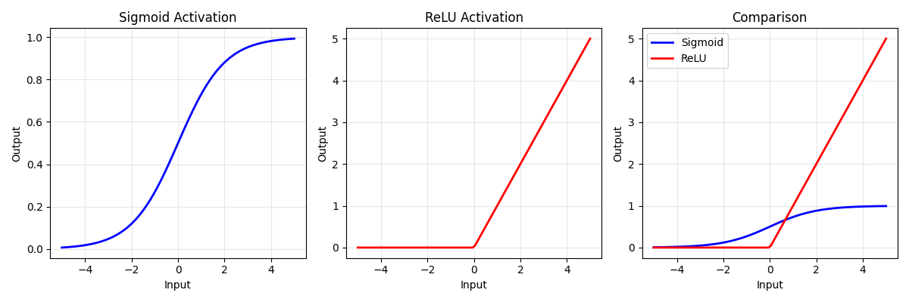

# Day [1] - [6/18/2025]: [The Foundations of Everything]

## Learning Objectives for Today

- Review matrix operations, especially convolution as matrix multiplication
- Understand backpropagation from first principles (not just as a black box)
- Implement a simple perceptron from scratch to solidify understanding
- Connect these concepts to how astronomical images are represented as matrices

---

## Theoretical Learning

### Key Concepts Covered
#### Mathematical Foundations:  

- Linear transformations (y = Wx + b) as the core neural network operation
- Activation functions (sigmoid vs ReLU) and their mathematical properties
- Numerical stability considerations in sigmoid implementation
- Function composition to build perceptrons

#### Learning Mechanisms:  

- Forward pass with cached intermediate values
- Backward pass implementing chain rule for gradient computation
- Gradient computation for weights, bias, and inputs
- Parameter updates using gradients
- Learning rate effects on convergence and precision

#### Fundamental Insights:  

- Why activation functions are necessary (preventing linear collapse)
- Parameter explosion problem motivating CNNs
- Precision limitations of different activation functions
- The complete learning cycle (forward → error → backward → update)

### Deep Dive: [Most Important Concept]

Okay let's talk about backpropagation as the chain rule.  

**My Understanding Before:** 

Previously I had heard this connection drawn in 3Blue1Brown's videos linked below. It didn't really click then.  

**What I Learned:**
The nested gradient calculations [here](../implementations/weak1_foundations/convolution_from_scratch/src/day01/nueral_network_foundations.py#L308) are the fruition of the what I learned!

**Mathematical Insights:**

$$\frac{\partial \text{loss}}{\partial \text{linear}} = \frac{\partial \text{loss}}{\partial \text{output}} \times \frac{\partial \text{output}}{\partial \text{linear}}$$  

$$\frac{\partial \text{loss}}{\partial \text{weights}} = \frac{\partial \text{loss}}{\partial \text{linear}} \times \frac{\partial \text{linear}}{\partial \text{weights}}$$  

$$\frac{\partial \text{loss}}{\partial \text{bias}} = \frac{\partial \text{loss}}{\partial \text{linear}} \times \frac{\partial \text{linear}}{\partial \text{bias}}$$  
    
$$\frac{\partial \text{loss}}{\partial \text{inputs}} = \frac{\partial \text{loss}}{\partial \text{linear}} \times \frac{\partial \text{linear}}{\partial \text{inputs}}$$  

### Questions That Arose
From backprop nothing much.

---

## Practical Implementation

### What I Built Today

I build [neural_network_foundations.py](../implementations/weak1_foundations/convolution_from_scratch/src/day01/nueral_network_foundations.py)

### Experimental Results

<div align="center">
  
  <p>Figure 1. Sigmoid vs ReLU plots.</p>
</div>

### Debugging and Problem-Solving  

Nothing went wrong really, I had a little trouble with the forward pass cache but after talking to a friend about it, the best way to impliment it was clear.  
I almost forgot, the numerical stability of the $x<0$ sigmoid was a little tough, but after a bit of research on related stuff I understood what to do.  


### Performance Observations
ReLU is much better! I did a little test comparison of the two that is no longer present in the code but basically i saw the ReLu reach a perfect prediction in around 2 phases but the sigmoid plateaued around $0.93$.

---

## Reflection and Synthesis

### Today's "Aha!" Moments
Learning the complete learning cycle of forward, error, backward, update makes SO much more sense than before!

### Connections to ShearNet Problem

My ReLU experiment proved that activation functions aren't limiting ShearNet's precision.

### What I Got Wrong
I felt training was a bit __magical__ but now I feel like I really understand it!

### Integration with Broader Understanding
Today was a ton of very very fundamental stuff, this is going to help me a lot with my basic understanding of everything!

---

## Tomorrow's Preparation

### Priority Questions for Tomorrow
What is convolution and how does it work??? How does a CNN employ it?

### Specific Things to Try
I want to get to astro stuff, I'm excited. Lets try to do some galaxy stuff.

### Connections to Explore
Tomorrow I hope to gain a much deeper understanding of image processing, since I did that excerise that showed the parameters needed explode.

---

## Resources Used Today

### Papers/Articles Read

Goodfellow, Ian, Yoshua Bengio, and Aaron Courville. Deep Learning. Adaptive Computation and Machine Learning series. Cambridge, Massachusetts: The MIT Press, 2016.

### Code References  

I mainly reference the textbook above and friends, I also referenced some examples on the numpy docs on how to use functions such as where.

### Videos/Lectures  

I didn't watch anything for todays work but I watched [3Blue1Brown's Neural Net Videos](https://youtube.com/playlist?list=PLZHQObOWTQDNU6R1_67000Dx_ZCJB-3pi&si=tM-UcnXyBAUJ9lx_) recently that directly pretain to this work.

---

## Personal Learning Notes

### What Learning Strategy Worked Best Today?
Hands-on coding definitely worked the best today, a bit of reading the cited textbook.

### Energy and Focus Patterns
I woke up at 3pm today, bad start. I had 2 redbulls so energy wasn't a problem, I hope to not rely on caffeine as much as I go forward in life and in this project.

### Adjustments for Tomorrow
Wake up earlier!

---

## Quick Reference Section

ReLU:

```
Mathematical form: 
    f(x) = x if x > 0
    f(x) = 0 if x ≤ 0
```

```python
np.maximum(0, x)
```

<div align="center">
  
  <p>Figure 1. Sigmoid vs ReLU plots</p>
</div>

[Forward pass](../implementations/weak1_foundations/convolution_from_scratch/src/day01/nueral_network_foundations.py#L252)

[Backwards pass](../implementations/weak1_foundations/convolution_from_scratch/src/day01/nueral_network_foundations.py#L282)

---

## Day [1] Summary
Basically today I learned forward and backward prop, I learned relu and sigmoid, along with basic training. I look forward to CNNs and astro.