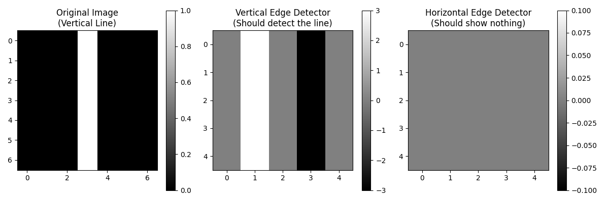
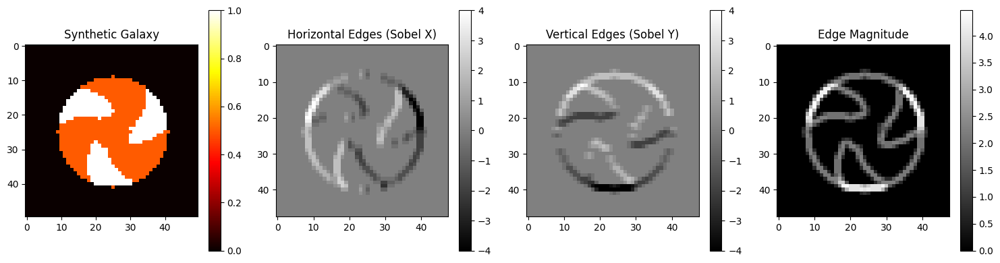

# Day [2] - [6/19/2025]: [Convolution, Kernels, and Edge Detection]

## Learning Objectives for Today

- Understand why fully connected layers fail for images (parameter explosion, lack of translation invariance)
- Grasp the motivation behind weight sharing and local connectivity
- Implement basic convolution operations manually before using frameworks
- Explore how convolution preserves spatial relationships in astronomical data

---

## Theoretical Learning

### Key Concepts Covered  
#### Convolution Mathematics:  

- 1D convolution as sliding dot product
- Extension to 2D convolution for images
- Stride and padding effects on output dimensions
- Relationship between convolution and correlation

#### Feature Detection Principles:  

- Kernels as learned feature detectors
- Edge detection kernels (vertical, horizontal, Sobel)
- How different kernels detect different patterns
- Feature map interpretation and visualization

#### Image Processing Applications:  

- Convolution applied to synthetic galaxy data
- Multiple kernel responses providing complementary information
- Edge magnitude calculation from multiple orientations
- Translation invariance and spatial relationship preservation

#### CNN Building Blocks:  

- Weight sharing concept through convolution
- Local connectivity vs full connectivity
- Feature extraction as automated pattern detection
- Connection between mathematical operations and intelligent behavior

### Deep Dive: [Most Important Concept]

Lets talk about the transition from 1D to 2D convolution and how the math scales to images.

**My Understanding Before:** 

My understanding before was nothing!  

**What I Learned:**
I learned what convolution and what a kernel was! This took place [here](../implementations/weak1_foundations/convolution_from_scratch/src/day02/convolution_math_derivation.py#L11) and [here](../implementations/weak1_foundations/convolution_from_scratch/src/day02/edge_detection_basics.py#L11)

**Mathematical Insights:**

$$C(i, j) = \sum_{m = 0}^{M_a-1}\sum_{n = 0}^{N_a-1} A(m, n) \times B(i-m, j-n)$$

**Connection to Previous Days:**

As you can see this above, this is just a special case of matrix multiplication, special because of $B(i-m, j-n)$.

### Questions That Arose

Not really, not right now.  

---

## Practical Implementation

### What I Built Today

I worked on the files in [day02](../implementations/weak1_foundations/convolution_from_scratch/src/day02) along with [kernels](../implementations/weak1_foundations/convolution_from_scratch/src/kernels)

### Experimental Results

From [convolution_math_derivation.py](../implementations/weak1_foundations/convolution_from_scratch/src/day02/convolution_math_derivation.py):
```
Signal: [1 2 3 4 5]
Kernel: [0.5 1.  0.5]
Result: [0.5 2.  4.  6.  8.  7.  2.5]
NumPy result: [0.5 2.  4.  6.  8.  7.  2.5]
Match: True
```

From [edge_detection_basics.py](../implementations/weak1_foundations/convolution_from_scratch/src/day02/edge_detection_basics.py):
```
Original image:
[[0. 0. 0. 1. 0. 0. 0.]
 [0. 0. 0. 1. 0. 0. 0.]
 [0. 0. 0. 1. 0. 0. 0.]
 [0. 0. 0. 1. 0. 0. 0.]
 [0. 0. 0. 1. 0. 0. 0.]
 [0. 0. 0. 1. 0. 0. 0.]
 [0. 0. 0. 1. 0. 0. 0.]]

Vertical edge detection result:
[[ 0.  3.  0. -3.  0.]
 [ 0.  3.  0. -3.  0.]
 [ 0.  3.  0. -3.  0.]
 [ 0.  3.  0. -3.  0.]
 [ 0.  3.  0. -3.  0.]]

Horizontal edge detection result:
[[0. 0. 0. 0. 0.]
 [0. 0. 0. 0. 0.]
 [0. 0. 0. 0. 0.]
 [0. 0. 0. 0. 0.]
 [0. 0. 0. 0. 0.]]
Original image:
[[0. 0. 0. 1. 0. 0. 0.]
 [0. 0. 0. 1. 0. 0. 0.]
 [0. 0. 0. 1. 0. 0. 0.]
 [0. 0. 0. 1. 0. 0. 0.]
 [0. 0. 0. 1. 0. 0. 0.]
 [0. 0. 0. 1. 0. 0. 0.]
 [0. 0. 0. 1. 0. 0. 0.]]

Vertical edge detection result:
[[ 0.  3.  0. -3.  0.]
 [ 0.  3.  0. -3.  0.]
 [ 0.  3.  0. -3.  0.]
 [ 0.  3.  0. -3.  0.]
 [ 0.  3.  0. -3.  0.]]

Horizontal edge detection result:
[[0. 0. 0. 0. 0.]
 [0. 0. 0. 0. 0.]
 [0. 0. 0. 0. 0.]
 [0. 0. 0. 0. 0.]
 [0. 0. 0. 0. 0.]]
```

<div align="center">
  
  <p>Figure 1. Edge detection visualized.</p>
</div>

From [galaxy_edge_detection.ipynb](../implementations/weak1_foundations/convolution_from_scratch/src/day02/galaxy_edge_detection.ipynb):
<div align="center">
  
  <p>Figure 2. Synthetic galaxy edge detection visualized.</p>
</div>

### Debugging and Problem-Solving

I mainly struggled with the imports in the ipynb, I realized that they were right but I needed to reset my kernel! I will always remember that first now when I have issues in a notebook.

### Performance Observations

Different kernels held different results but that is obvious, no other performance observations can be made today.

---

## Reflection and Synthesis

### Today's "Aha!" Moments

The main aha moment I had was when I first generated the galaxy edge detection image above. That was awesome!

### Connections to ShearNet Problem

I just implemented the exact feature extraction process that ShearNet uses. Those spiral arm detections are directly relevant to shape measurement.

### What I Got Wrong

I mean it isn't misconceptions that were corrected but I had no idea what convolution or kernels were.

### Integration with Broader Understanding

This is fundamental as convolution is literally in the name of CNN!

---

## Tomorrow's Preparation

### Priority Questions for Tomorrow

Looking at the image above of galaxy edge ditection, how does that actually lead to spitting out "This is a spiral galaxy"??? Another neural net? That makes no sense to me.

### Specific Things to Try

Get code "spitting out 'This is a spiral galaxy'"!

### Connections to Explore

I hope tomorrow will enhance my understanding of the different kernels I coded today.

---

## Resources Used Today

### Papers/Articles Read

Goodfellow, Ian, Yoshua Bengio, and Aaron Courville. Deep Learning. Adaptive Computation and Machine Learning series. Cambridge, Massachusetts: The MIT Press, 2016.

### Code References

I mainly reference the textbook above and friends, I also referenced some examples of 2D conv in other contexts to help me code it.

### Videos/Lectures

I didn't watch anything for todays work.

---

## Personal Learning Notes

### What Learning Strategy Worked Best Today?

Definetly hands-on coding!

### Energy and Focus Patterns

I was more productive around dinner time, it slowely ramped down at the time hit midnight, 1am, 2am.

### Adjustments for Tomorrow

Go to sleep earlier!

---

## Quick Reference Section

[21D Convolution](../implementations/weak1_foundations/convolution_from_scratch/src/day02/convolution_math_derivation#L11)

[2D Convolution](../implementations/weak1_foundations/convolution_from_scratch/src/day02/edge_detection_basics.py#L11)

---

## Day [2] Summary

Today I learned convolution and kernels, along with getting my first taste of astrophysics applications with a synthetic galaxy!