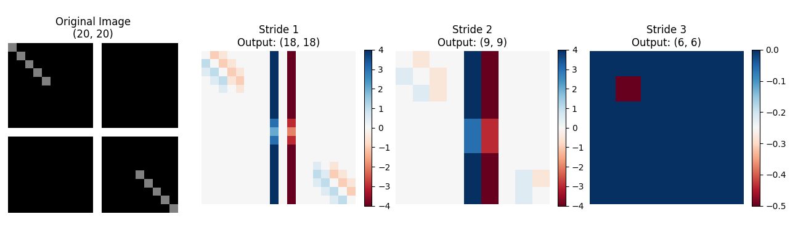
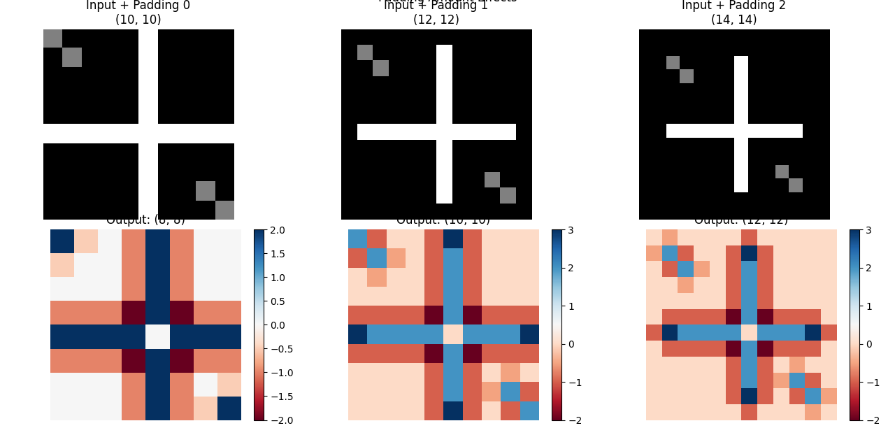
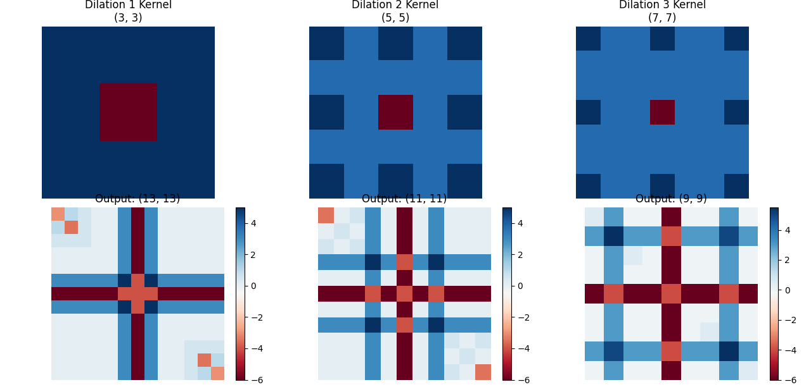
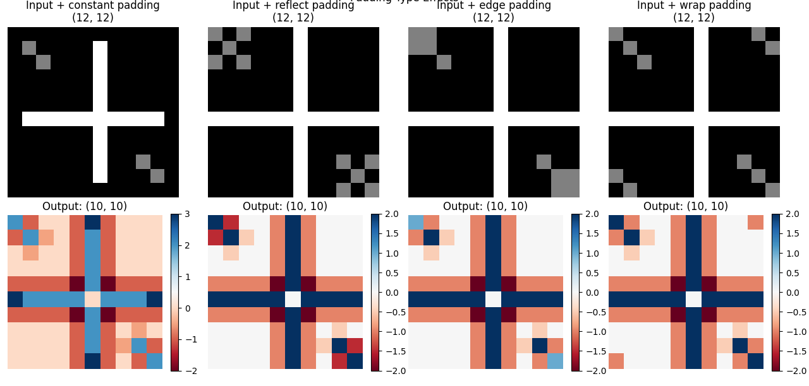

# Day [3] - [6/20/2025]: [Deep Dive into Kernels and Convolution]

## Learning Objectives for Today

- Understand stride, padding, and dilation thoroughly
- Learn about different padding strategies and when to use each
- Explore how kernel size affects receptive field and computational cost
- Practice calculating output dimensions for different convolution configurations

---

## Theoretical Learning

### Key Concepts Covered
#### Convolution Parameter Mechanics:

- Stride effects on output dimensions and spatial sampling
- Padding strategies: amounts (0, 1, 2) and their impact on output size preservation
- Dilation: expanding receptive fields without increasing parameters
- Mathematical relationships between input size, kernel size, stride, padding, and output dimensions

#### Padding Strategy Deep Dive:

- **Constant padding:** Zero-padding around borders (most common)
- **Reflect padding:** Mirror image values at boundaries
- **Edge padding:** Extend border pixel values
- **Wrap padding:** Circular boundary conditions
- Impact of padding choice on boundary artifact handling in astronomical images

#### Stride and Spatial Resolution Trade-offs:

- Stride=1: Full spatial resolution preservation
- Stride=2: 2× spatial downsampling with 4× computational savings
- Stride=3: More aggressive downsampling for efficiency
- Connection between stride choice and precision requirements

#### Dilation and Receptive Field Engineering:

- Dilation as a method to increase receptive field without parameter growth
- Mathematical implementation: inserting zeros between kernel elements
- Effective kernel size calculation: `new_size = original_size + (original_size - 1) × (dilation - 1)`
- Applications for detecting large-scale features efficiently

#### Output Dimension Mathematical Framework:

- Core formula: `output_size = (input_size + 2×padding - kernel_size) // stride + 1`
- Multi-layer receptive field accumulation across CNN depth
- Receptive field growth: `RF = RF + (kernel_size - 1) × jump`
- Jump calculation through layers: `jump = jump × stride`

#### Computational Cost Analysis and Architecture Trade-offs:

- Operations count: `output_h × output_w × kernel_h × kernel_w`
- Impact of parameter choices on computational requirements:
    - Larger kernels (5×5 vs 3×3): 2.78× cost increase
    - Stride=2: 4× cost reduction (0.25× relative cost)
    - Padding effects on operation count
- Architecture design implications for balancing efficiency vs precision

#### CNN Architecture Design Principles:

- Relationship between receptive field requirements and network depth
- Trade-offs between spatial precision and computational efficiency
- Impact of parameter choices on memory usage and inference speed
- Connection between convolution mechanics and feature detection capability

### Deep Dive: [Most Important Concept]

Lets talk about how dilation enables efficient large-scale feature detection in astronomical images.

**My Understanding Before:** 

Before I started this repo, when I thought of detecting large-scale features in galaxy images (like overall galaxy shape or etended spiral arms), I figured CNNs just needed to look at larger portions of the picture at once.  
This idea came together in my head yesterday as using bigger kernels (like 15x15 or 21x21).  
Never did I think of the idea of dilation.  

**What I Learned:**

I leanred what dilation actually does mathematically.  
Looking at my `apply_dilation()` function, I implemented the exact mathematical operation:  
My original 3×3 edge detector kernel:  
```python
[[ 1,  1,  1],
 [ 1, -8,  1], 
 [ 1,  1,  1]]
```
With dilation=2, my code inserted zeros between elements:  
```python
[[ 1,  0,  1,  0,  1],
 [ 0,  0,  0,  0,  0],
 [ 1,  0, -8,  0,  1],
 [ 0,  0,  0,  0,  0],
 [ 1,  0,  1,  0,  1]]
```
My mathematical formula: `new_size = original_size + (original_size - 1) × (dilation - 1)`  

- Dilation=2: `3 + (3-1) × (2-1) = 5×5`
- Dilation=3: `3 + (3-1) × (3-1) = 7×7`

This creates larger receptive fields without adding parameters.  
My results showed:  

- Dilation 1: 3×3 kernel with 9 parameters
- Dilation 2: 5×5 effective field with still only 9 parameters
- Dilation 3: 7×7 effective field with still only 9 parameters

The magic: my convolution still only does 9 multiplications per output pixel, but now samples from a 7×7 area instead of 3×3!  
This is revolutionary for astronomical applications.  
From my visualizations today:  

- Traditional approach: To detect large galaxy features, you'd need a 7×7 kernel = 49 parameters
- The dilation approach: Same detection capability with 3×3 kernel = 9 parameters
- Efficiency gain: 5.4× fewer parameters for same spatial coverage

For galaxies specifically:

- Spiral arms can span large spatial scales
- Galaxy halos extend far from centers
- My dilated kernels can detect these without massive computational cost

My 3×3 kernel becomes effectively 7×7 with dilation=3.  
My implementation showed:  

1. Original kernel: Detects features in immediate 3×3 neighborhood
2. Dilation=3 result: Same 9 weights now sample from 7×7 area with 2-pixel gaps
3. My visualization: The kernel "reaches out" to detect features at larger scales

**The key insight from my results:** The dilated kernel maintains the same edge detection pattern but now operates over a much larger spatial extent - perfect for detecting extended galaxy structures!  

**Connection to Previous Days:**

Previously I only had a bunch of different 3x3 kernels, I was curious what happens when I increased the dimensions, but now I know! It opens up a whole world of optimization and feature detection that is very relevant to ShearNet.

### Questions That Arose

How exactly do I avoid doing the multiplication by zero and taking up compute time?  
I think I could do something like this:
```python 
def manual_convolution_2d_efficient_dilation(image, kernel, stride=1, padding=0, dilation=1):
    """Efficient dilation - only compute non-zero kernel positions."""
    
    if padding > 0:
        image = np.pad(image, padding, mode='constant', constant_values=0)
    
    image_h, image_w = image.shape
    kernel_h, kernel_w = kernel.shape
    
    # Calculate output dimensions (dilation affects effective kernel size)
    effective_kernel_h = kernel_h + (kernel_h - 1) * (dilation - 1)
    effective_kernel_w = kernel_w + (kernel_w - 1) * (dilation - 1)
    
    output_h = (image_h - effective_kernel_h) // stride + 1
    output_w = (image_w - effective_kernel_w) // stride + 1
    output = np.zeros((output_h, output_w))
    
    # Efficient convolution: only compute original kernel positions
    for i in range(output_h):
        for j in range(output_w):
            start_i = i * stride
            start_j = j * stride
            
            # Only iterate over ORIGINAL kernel positions
            for ki in range(kernel_h):
                for kj in range(kernel_w):
                    # Apply dilation in the sampling, not in kernel creation
                    img_i = start_i + ki * dilation  # Skip by dilation amount
                    img_j = start_j + kj * dilation
                    
                    # Use original kernel values (no zeros!)
                    output[i, j] += image[img_i, img_j] * kernel[ki, kj]
    
    return output
```
Leading to never actually creating the zero-padded kernels, and no useless multiplication by zero.  

---

## Practical Implementation

### What I Built Today

I built a comprehensive convolution mechanics library with:  
- `manual_convolution_2d_extended()` - Full convolution with stride, padding, and dilation
- `apply_dilation()` - Mathematical dilation implementation
- `manual_convolution_2d_with_padding_types()` - Multiple padding strategies  
- Three demonstration functions with visualizations
- Mathematical analysis functions

### Experimental Results

<div align="center">
  
  <p>Figure 1. Stride Effect Demo.</p>
</div>

<div align="center">
  
  <p>Figure 2. Padding Strategies Demo.</p>
</div>

<div align="center">
  
  <p>Figure 3. Dilation Effects Demo.</p>
</div>

<div align="center">
  
  <p>Figure 4. Different Padding Types Visualized.</p>
</div>

### Debugging and Problem-Solving

I gave up fixing visualization overlaps as seen in all of the above images. This is about CNNs not matplotlib lol.  
Also array indexing for strides got me for a bit cause I'm silly.  

### Performance Observations

Dilation could actually be the key to ShearNet's problems, I am excited to look into what type of dilation is implimented currently.  

---

## Reflection and Synthesis

### Today's "Aha!" Moments

Today's aha moment was when I coded the [`apply_dilation()`](../implementations/weak1_foundations/convolution_from_scratch/src/day03/convolution_mechanics.py#L120)

### Connections to ShearNet Problem

My primary assignment is to make ShearNet perform better at low-noise shape measurement. Dilation really could be an amazing technology to help in this endeavor. With a breif look into the code I really can't see any application of dilation in ShearNet, but I also have zero familiary with Jax or Flax.

### Integration with Broader Understanding

Well I understand how CNNs could potentially see larger scale patterns without more paramaters!

---

## Tomorrow's Preparation

### Priority Questions for Tomorrow

When do you actually impliment dilation in a CNN? Like at what step is a kernel dilated? Is dilation permenant, I guess I still have a disconnect from actually CNN work.

### Specific Things to Try

Use Jax, since that's what ShearNet is developed with.

### Connections to Explore

I think a deeper connection to real CNN research with a library like Jax could help enhance my understanding of everything I've done so far.

---

## Resources Used Today

### Papers/Articles Read

Goodfellow, Ian, Yoshua Bengio, and Aaron Courville. Deep Learning. Adaptive Computation and Machine Learning series. Cambridge, Massachusetts: The MIT Press, 2016.

### Code References

Primarily numpy docs for things like `np.zeros()` and such. I mainly used my previously developed code today.  

### Videos/Lectures

Nothing today unfortunately.  

---

## Personal Learning Notes

### What Learning Strategy Worked Best Today?

Hands-on codind ofc  

### Energy and Focus Patterns

Today I did well, I think the support from my gf was key to being able to focuse, usually coding means ignoring her and that throws off my concentration but today she was okay with me coding.  

### Adjustments for Tomorrow

Probably wake up to my alarm lol, slept an extra 2 hours cause I didn't hear my alarm.  

---

## Quick Reference Section

Pretty much the entire [`convolution_mechanics.py`](../implementations/weak1_foundations/convolution_from_scratch/src/day03/convolution_mechanics.py) file, but mainly [`apply_dilation()`](../implementations/weak1_foundations/convolution_from_scratch/src/day03/convolution_mechanics.py#L120)

---

## Day [3] Summary

Dilation is cool. Convolution is crazy. Kernels. Pretty much. I played my first mario kart world grand prix and won today!  